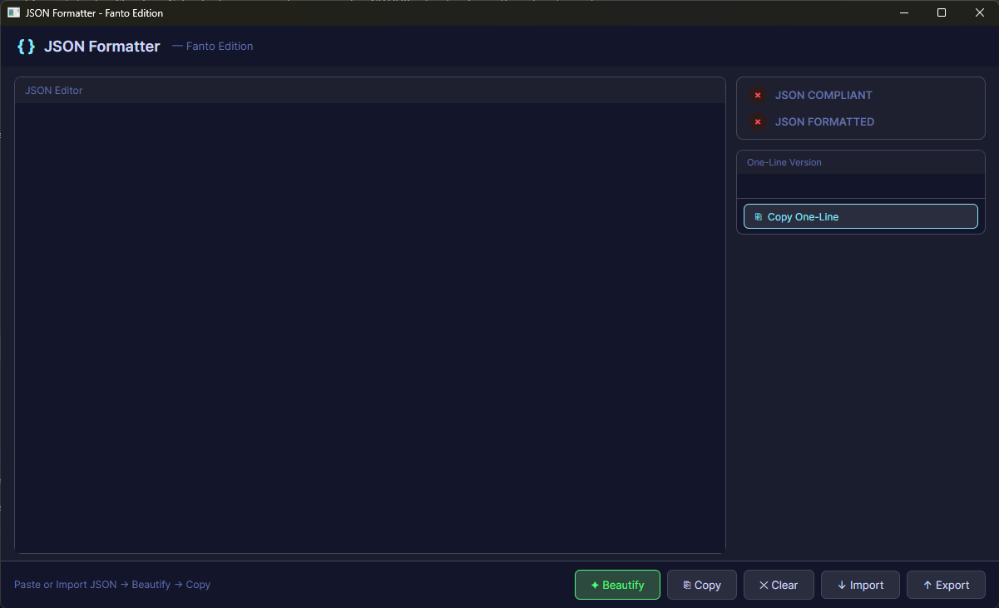
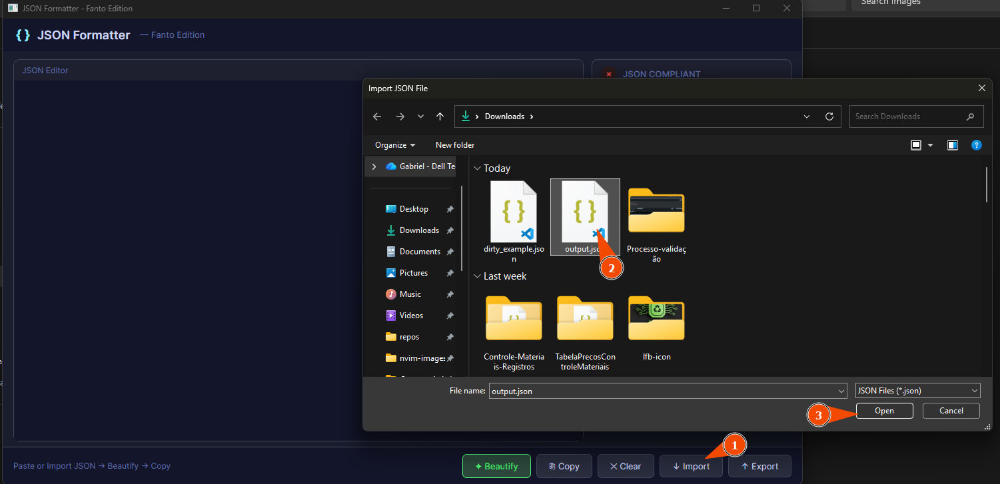
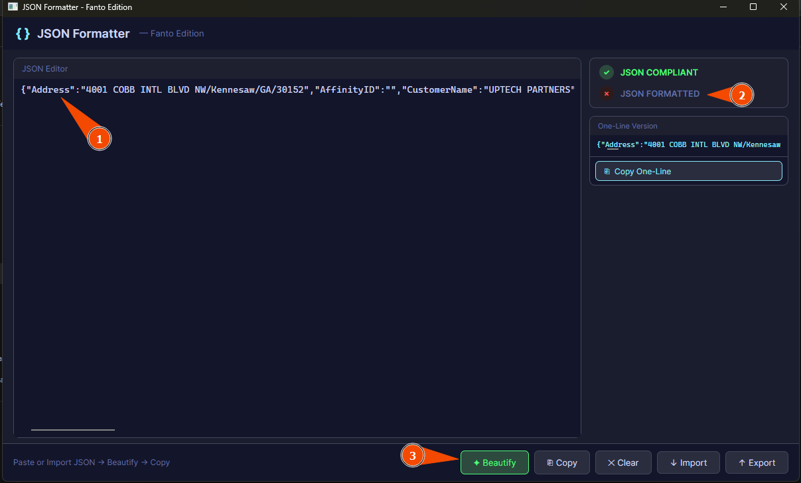
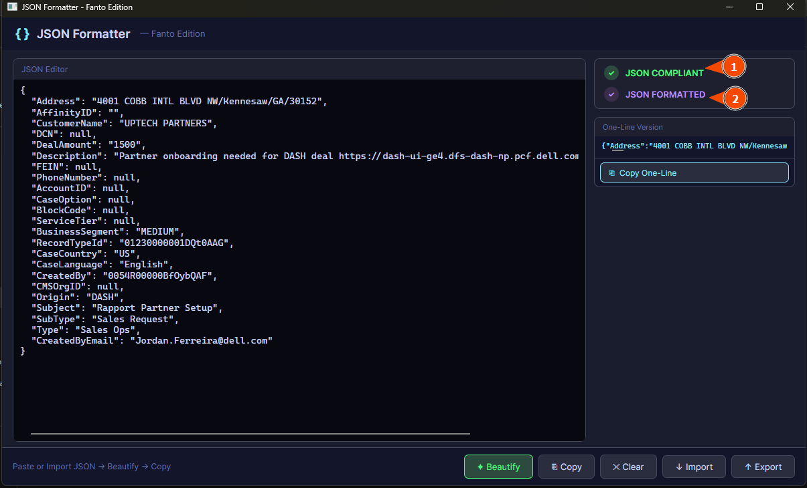
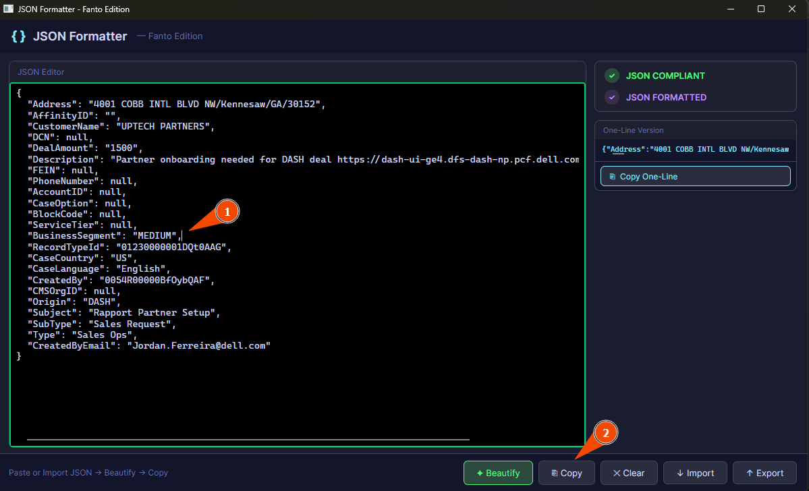
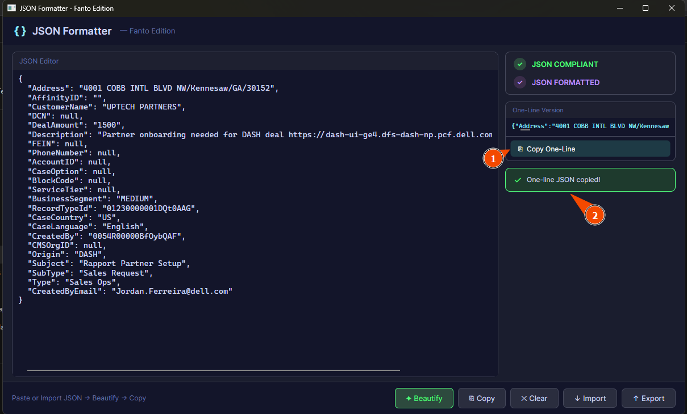
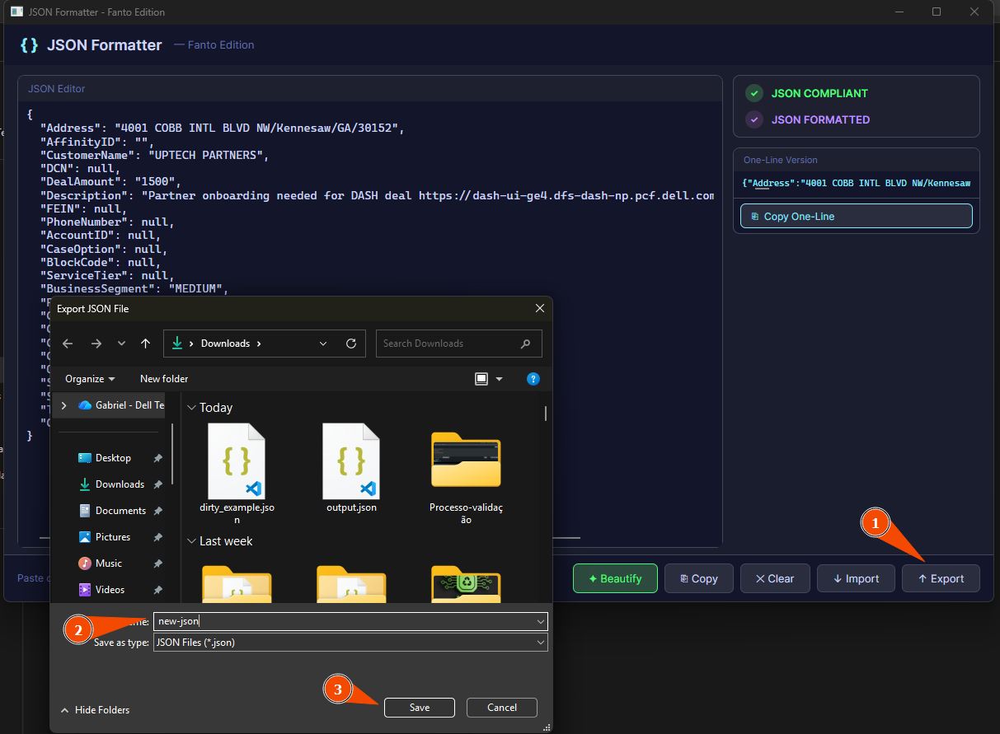

# JSON Formatter — Fanto Edition

A desktop application for formatting, validating, and working with JSON data, built with **.NET 10** and **Avalonia UI**.

---

## Features

- **Paste or type** JSON directly into the editor
- **Import** a `.json` file — automatically validates and checks if it's already formatted
- **Beautify** — reformats JSON with proper indentation in place
- **Validation** — real-time feedback showing exactly where the JSON structure breaks (line + position)
- **One-Line Version** — compact single-line preview of valid JSON in the right panel
- **Copy** — copies the current editor content to clipboard
- **Copy One-Line** — copies the compact single-line version to clipboard
- **Clear** — resets the editor and all status indicators
- **Export** — saves the current editor content to a `.json` file
- **Status indicators** — `JSON COMPLIANT` and `JSON FORMATTED` update live as you type or import
- **Line numbers** — formatted view now shows line numbers alongside the highlighted JSON
- **Search bar** — search inside the formatted JSON; hits are highlighted and the status icon shows ✔/✘
- **Edit toggle** — after Beautify you can click **✎ Edit** to return to the editable view with the beautified JSON

---

## User Guide

### 1. Starting the Application

When the application opens, you will see the empty editor ready to receive JSON content.
The status panel on the right shows **✗ JSON COMPLIANT** and **✗ JSON FORMATTED** in red, indicating no content has been entered yet.
The toolbar at the bottom provides all available actions.



---

### 2. Importing a JSON File

To load a JSON file from disk:

1. Click the **↓ Import** button in the bottom toolbar
2. A file picker dialog will open — navigate to your `.json` file
3. Select the file and click **Open**

The file content will be loaded directly into the editor and automatically validated.



---

### 3. Pasting Unformatted JSON — Before Beautify

You can also paste JSON directly into the editor using **Ctrl+V**.

In the example below, a minified (single-line) JSON was pasted. Notice:
- **(1)** The editor shows the raw unformatted content
- **(2)** The status shows **✓ JSON COMPLIANT** (valid structure) but **✗ JSON FORMATTED** (not indented yet)
- **(3)** The **✦ Beautify** button is ready to reformat it



---

### 4. After Clicking Beautify

After clicking **✦ Beautify**, the JSON is reformatted with proper indentation in place. Notice:
- **(1)** **✓ JSON COMPLIANT** — the JSON structure is valid
- **(2)** **✓ JSON FORMATTED** — the JSON now follows the standard indentation format
- **(3)** Line numbers appear on the left of the formatted/highlighted view

The One-Line Version panel on the right also shows the compact single-line version.



---

### 5. Editing JSON and Copying

The editor is fully editable — you can click anywhere in the text and modify it directly.

- **(1)** Click anywhere in the editor to position the cursor and edit the content
- **(2)** Click **⎘ Copy** to copy the entire formatted JSON to clipboard



---

### 6. Copying the One-Line Version

The **One-Line Version** panel on the right always shows a compact minified version of your valid JSON. This is useful for APIs, environment variables, or any context that requires a single-line JSON string.

- **(1)** Click **Copy One-Line** to copy the compact version
- **(2)** A green confirmation **"One-line JSON copied!"** notification appears briefly



---

### 7. Searching Inside the Formatted JSON

- Type in the **Search in JSON...** box (header of the editor) while in the beautified view.
- Matches are highlighted in **orange**; the search status icon shows **✔** (found) or **✘** (not found).

---

### 8. Editing After Beautify

- After you click **✦ Beautify**, the toolbar shows **✎ Edit**.
- Click **✎ Edit** to return to the editable `TextBox` with the beautified JSON content preserved.
- You can beautify again at any time.

---

### 7. Exporting to a File

To save the current JSON content to a file:

1. **(1)** Click **↑ Export** in the bottom toolbar
2. **(2)** A save dialog opens — choose the destination folder and type a file name
3. **(3)** Click **Save** to write the file to disk



---

## Installation

### Prerequisites

- [.NET 10 SDK](https://dotnet.microsoft.com/download/dotnet/10.0) — required to build and run from source

---

### Option 1 — Clone and Run from Source

```powershell
# Clone the repository
git clone https://github.com/F4NT0/JsonFormatter.git

# Enter the project folder
cd JsonFormatter

# Run the application
dotnet run
```

---

### Option 2 — One-liner: Clone, Build and Run

```powershell
git clone https://github.com/F4NT0/JsonFormatter.git && cd JsonFormatter && dotnet run
```

---

### Option 3 — Publish a Self-Contained `.exe` (no install required)

This generates a single `.exe` that runs on any Windows machine **without needing .NET installed** or any admin permissions.

```powershell
dotnet publish -c Release -r win-x64 --self-contained true -p:PublishSingleFile=true -o ./publish
```

The output will be in the `./publish` folder. Just copy `JsonFormatter.exe` to any Windows machine and double-click to run — no installation needed.

> To target other platforms:
> - **Windows ARM64:** replace `win-x64` with `win-arm64`
> - **Linux x64:** replace `win-x64` with `linux-x64`
> - **macOS:** replace `win-x64` with `osx-x64`

---

## Project Structure

```
JsonFormatter/
├── App.axaml                          # Application entry, dark theme, global resources
├── App.axaml.cs                       # Application startup
├── MainWindow.axaml                   # Main window UI layout (AXAML)
├── MainWindow.axaml.cs                # Main window code-behind (event handlers, UI sync)
├── Program.cs                         # Entry point, Avalonia bootstrapping
├── app.manifest                       # Windows application manifest
├── JsonFormatter.csproj               # Project file (.NET 10, Avalonia packages)
│
├── ViewModels/
│   └── MainWindowViewModel.cs         # MVVM ViewModel — JSON state, validation, file ops
│
├── Converters/
│   ├── BoolToColorConverter.cs        # IValueConverter: bool → color string
│   └── BoolToCheckConverter.cs        # IValueConverter: bool → ✓ or ✗ symbol
│
├── Highlighting/
│   └── JsonHighlightingColorizer.cs   # DocumentColorizingTransformer for JSON syntax colors
│
└── docs/
    └── images/                        # Screenshots used in this README
```

---

## Architecture

The application follows the **MVVM (Model-View-ViewModel)** pattern:

```
┌─────────────────────────────────────────────────────────┐
│                    MainWindow.axaml                     │
│              (View — pure AXAML layout)                 │
│  TextBox Editor │ Status Dots │ One-Line Panel │ Toolbar │
└────────────────────────┬────────────────────────────────┘
                         │ code-behind wires events
┌────────────────────────▼────────────────────────────────┐
│                  MainWindow.axaml.cs                    │
│  - Hooks Editor.TextChanged                             │
│  - Calls SyncStatus() to update named controls          │
│  - Handles button clicks (Beautify, Import, Export...)  │
└────────────────────────┬────────────────────────────────┘
                         │ reads/writes properties
┌────────────────────────▼────────────────────────────────┐
│              MainWindowViewModel.cs                     │
│  - JsonText        → triggers ValidateJson() on set     │
│  - IsJsonValid     → true if JSON parses successfully   │
│  - IsJsonFormatted → true if matches beautified form    │
│  - ValidationMessage → friendly error with line/pos     │
│  - OneLineJson     → minified single-line version       │
│  - BeautifyJson()  → reformats _jsonText in place       │
│  - ImportJson()    → reads file, sets JsonText          │
│  - ExportJson()    → writes JsonText to file            │
└─────────────────────────────────────────────────────────┘
```

---

## Tech Stack

| Technology | Version | Purpose |
|---|---|---|
| [.NET](https://dotnet.microsoft.com/) | 10.0 | Runtime and build system |
| [Avalonia UI](https://avaloniaui.net/) | 11.3.12 | Cross-platform desktop UI framework |
| [Avalonia.AvaloniaEdit](https://github.com/AvaloniaUI/AvaloniaEdit) | 11.3.0 | Advanced text editor component |
| [Avalonia.Themes.Fluent](https://github.com/AvaloniaUI/Avalonia) | 11.3.12 | Fluent design theme |
| System.Text.Json | Built-in | JSON parsing and serialization |

---

## Key Technical Notes

> For developers working on this project:

- **`AvaloniaUseCompiledBindingsByDefault` must be `false`** in the `.csproj` — setting it to `true` breaks the AXAML source generator and prevents `InitializeComponent` and `x:Name` fields from being emitted.
- **`Text="{ }"` in AXAML** is parsed as an invalid binding expression and silently kills the source generator. Always use `Text="{}{ }"` to escape literal curly braces.
- **`x:DataType` on the Window** must not be set — it conflicts with named control field generation.
- All UI state (status dots, error bar, notification) is managed manually in code-behind via `SyncStatus()` and `SyncNotification()` — no AXAML data bindings for these controls.
- The `TextBox` editor uses `AcceptsReturn="True"` and `AcceptsTab="True"` for multi-line JSON editing.

---

## Author

**F4NT0** — [fantolaboratorio@hotmail.com](mailto:fantolaboratorio@hotmail.com)

---

## License

This project is for personal/internal use. No license defined yet.
